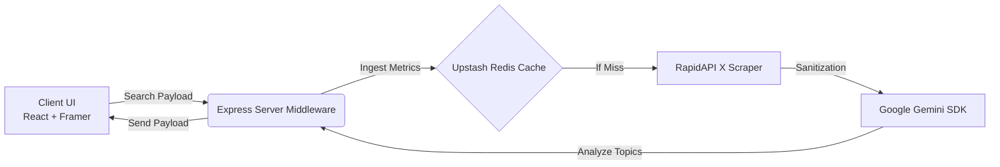

<div align="center">
  

  <br />
  <br />

  <h1>🔮 AuraScore AI</h1>

  <p>
    <strong>A highly dynamic, AI-powered social engagement profiler.</strong><br/>
    Built with React, Framer Motion, and the Google Gemini SDK.
  </p>

  <p>
    
    
    
    
    
    
  </p>
  
  <br />
</div>

## 📖 Overview

**AuraScore AI** redefines how we visualize social engagement. Instead of flat numbers, it instantly scrapes a user's X (Twitter) profile, interpolates organic reach using the **Gemini AI SDK**, and presents a stunning, deterministic Glassmorphism dashboard uniquely colored based on the user's payload footprint.

### ✨ Key Features
- **Deterministic Color Mapping:** Unique color palettes automatically generated via string-hash matrices for every individual profile.
- **Micro-interactions & Physics:** Powered entirely by `framer-motion` to spring-animate metric counters on a stagger.
- **Enterprise-Ready:** Hardened with a multi-stage `Dockerfile`, strict `eslint` policies, and integrated CI/CD via GitHub Actions.

---

## 🏗️ Architecture



---

## 🚀 Quick Start (Local)

To run this application locally outside of Docker, ensure you have Node.js (`v20.x` or higher) installed.

```bash
# 1. Clone the repository
git clone https://github.com/HemachandRavulapalli/AuraScoreAI.git
cd AuraScoreAI

# 2. Install dependencies via clean install
npm ci

# 3. Setup your environment keys
cp .env.example .env
# Edit .env with your GROQ / GEMINI keys!

# 4. Start the development server
npm run dev
```

Open `http://localhost:3000` to view the application in action.

---

## 🐳 Docker Deployment

AuraScore AI uses a robust multi-stage Docker build, isolating the Vite compilation environment from the minimal Alpine runtime environment to sharply reduce container sizes.

```bash
# Spin up the container stack immediately in detached mode
docker-compose up -d --build
```
The Express backend proxy and Vite static artifacts will reliably run at `http://localhost:3000`.

---

## 🔄 CI/CD CI Pipeline

This repository is strictly protected by a GitHub Actions Continuous Integration pipeline:
- **Linting:** Validates zero TypeScript deviations.
- **Build Verification:** Executes `vite build` cleanly to ensure the Docker matrix will successfully compile.
- Triggered automatically on all pushes to `main` and active Pull Requests.
